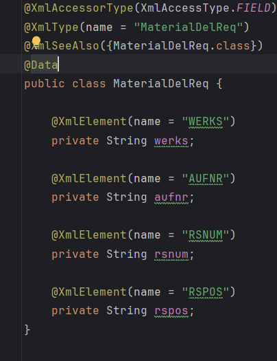

# webService

#### 介绍
webService 接口调用

#### 软件架构
springboot + cxf


#### 安装教程

1.  clone 代码
2.  拉去 maven 依赖
3.  启动调用

#### 使用说明

1.  简单的服务端和客户端示例
2.  可以在服务端实体类的类名或字段里设置对外暴露的字段



3. 需注意时间类型转换
4. 拿到WSDL地址之后，可以在线生成代码，也可以右键下载保存，离线生成代码
```shell
# 使用此命令，将XML文件编译为java类文件：
wsimport -encoding utf-8 -keep -s E:\javacode -verbose -extension file:///E:\Service.wsdl
#或者 
wsimport -encoding utf-8 -keep -s E:\javacode -verbose -extension http://localhost:8080/webService/userWebService?wsdl
```

### [博客连接](https://www.yanshuwen.top/archives/SpringBoot%20%2B%20WebService%28cxf%29%20%E7%AE%80%E5%8D%95%E8%B0%83%E7%94%A8)


